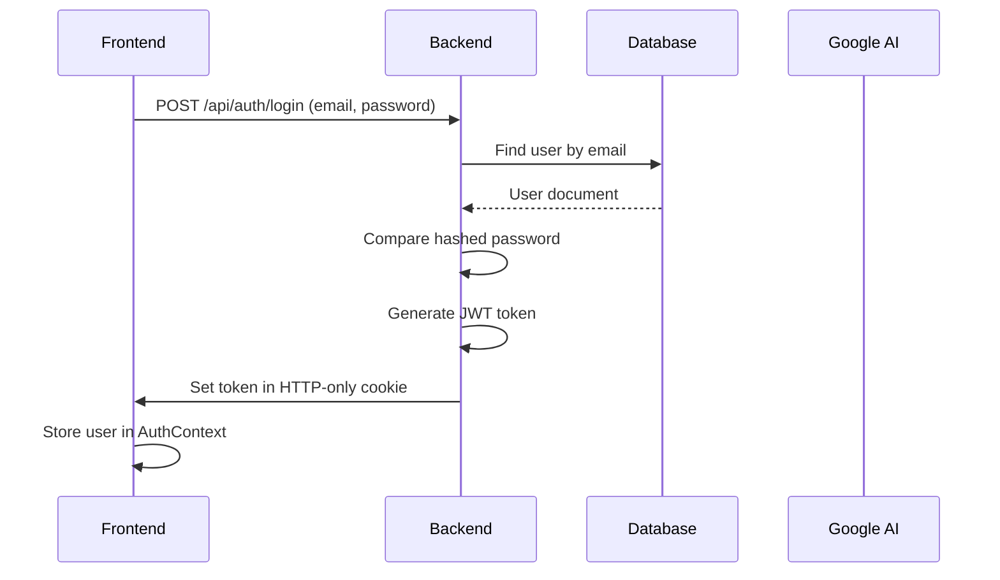
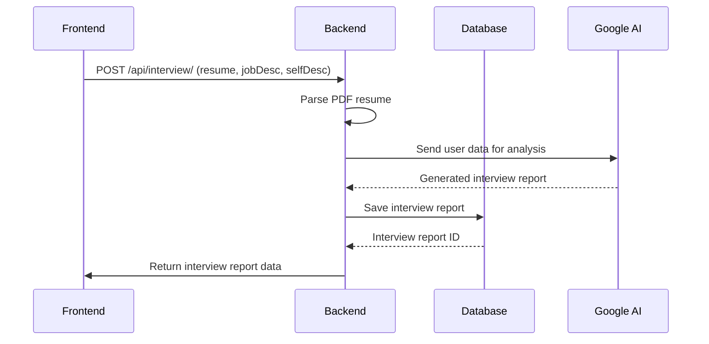

# 🏗️ Interview AI - Architecture Documentation

## 📋 Overview

**Interview AI** is a full-stack web application built with a modern MERN (MongoDB, Express, React, Node.js) architecture. The platform leverages AI-powered capabilities to generate personalized interview preparation materials based on user resumes and job descriptions.

---

## 🏛️ High-Level Architecture

```
┌─────────────────┐    HTTP/HTTPS    ┌─────────────────┐    API Calls     ┌─────────────────┐
│   Frontend      │ ◄──────────────► │   Backend API   │ ◄──────────────► │   External      │
│   (React SPA)   │                  │   (Express.js)  │                  │   Services      │
│   Port: 5173    │                  │   Port: 3000    │                  │                 │
└─────────────────┘                  └─────────────────┘                  └─────────────────┘
         │                                     │                                   │
         │                                     │                                   │
         ▼                                     ▼                                   ▼
┌─────────────────┐                  ┌─────────────────┐                  ┌─────────────────┐
│   Browser       │                  │   Node.js       │                  │   Google AI     │
│   Storage       │                  │   Server        │                  │   API           │
│   (Cookies)     │                  │   Memory        │                  │   (GenAI)       │
└─────────────────┘                  └─────────────────┘                  └─────────────────┘
                                                                 │
                                                                 ▼
                                                    ┌─────────────────┐
                                                    │   MongoDB       │
                                                    │   Database      │
                                                    │   (Atlas/Local) │
                                                    └─────────────────┘
```

---

## 🔧 Technology Stack

### Frontend Layer
- **React 19.2.0** - UI framework with modern hooks and concurrent features
- **React Router 7.13.0** - Client-side routing for SPA navigation
- **Vite 7.3.1** - Build tool and development server
- **Sass 1.97.3** - CSS preprocessor for styling
- **Axios 1.13.5** - HTTP client for API communication

### Backend Layer
- **Node.js** - JavaScript runtime environment
- **Express 5.2.1** - Web framework for REST API
- **MongoDB with Mongoose 9.2.1** - NoSQL database with ODM
- **JWT Authentication** - Token-based authentication system
- **Google Generative AI** - AI service for content generation
- **Puppeteer 24.37.5** - Headless browser for PDF generation
- **Security Libraries** - bcryptjs, cors, cookie-parser, zod

---

## 🏢 Frontend Architecture

### Component Structure
```
Frontend/src/
├── App.jsx                    # Root component with providers
├── main.jsx                   # Application entry point
├── app.routes.jsx             # Route configuration
├── style.scss                 # Global styles
├── features/                  # Feature-based modules
│   ├── auth/                  # Authentication feature
│   │   ├── auth.context.jsx   # Auth state management
│   │   ├── pages/             # Auth pages (Login, Register)
│   │   └── components/        # Auth components (Protected)
│   └── interview/             # Interview feature
│       ├── interview.context.jsx # Interview state management
│       ├── pages/             # Interview pages (Home, Interview)
│       └── components/        # Interview-specific components
└── style/                     # Styling assets
```

### State Management Pattern
- **Context API** for global state (Auth, Interview)
- **Local State** with React hooks for component-specific data
- **Cookie-based Authentication** for session persistence

### Routing Architecture
```javascript
// Protected Routes Pattern
{
  path: "/",
  element: <Protected><Home /></Protected>
},
{
  path: "/interview/:interviewId", 
  element: <Protected><Interview /></Protected>
}

// Public Routes
{
  path: "/login",
  element: <Login />
},
{
  path: "/register", 
  element: <Register />
}
```

---

## 🖥️ Backend Architecture

### Layered Architecture Pattern
```
Backend/src/
├── server.js                  # Server bootstrap
├── app.js                     # Express app configuration
├── config/                    # Configuration layer
│   └── database.js            # MongoDB connection
├── models/                    # Data models (Mongoose schemas)
│   ├── user.model.js          # User entity
│   ├── interviewReport.model.js # Interview report entity
│   └── blacklist.model.js     # Token blacklist
├── controllers/               # Request handlers
│   ├── auth.controller.js     # Authentication logic
│   └── interview.controller.js # Interview business logic
├── routes/                    # API route definitions
│   ├── auth.routes.js         # Auth endpoints
│   └── interview.routes.js    # Interview endpoints
├── middlewares/               # Request processing
│   ├── auth.middleware.js     # JWT authentication
│   └── file.middleware.js     # File upload handling
└── services/                  # External service integrations
    └── genai.service.js       # Google AI integration
```

### Data Models

#### User Model
```javascript
{
  username: String (unique, required),
  email: String (unique, required), 
  password: String (hashed, required)
}
```

#### Interview Report Model
```javascript
{
  jobDescription: String (required),
  resume: String,
  selfDescription: String,
  matchScore: Number (0-100),
  technicalQuestions: [{ question, intention, answer }],
  behavioralQuestions: [{ question, intention, answer }],
  skillGaps: [{ skill, severity: "low|medium|high" }],
  preparationPlan: [{ day, focus, tasks }],
  user: ObjectId (ref: 'users'),
  title: String (required),
  timestamps: true
}
```

---

## 🔄 Communication Flow

### Authentication Flow


### Interview Report Generation Flow


### API Communication Pattern

#### Request Structure
```javascript
// Frontend API calls using Axios
const API_BASE_URL = "http://localhost:3000/api"

// Authenticated requests (JWT in cookie)
axios.post(`${API_BASE_URL}/interview/`, formData, {
  withCredentials: true // Important for cookie handling
})

// Public requests  
axios.post(`${API_BASE_URL}/auth/login`, credentials)
```

#### Response Structure
```javascript
// Success Response
{
  success: true,
  data: { ... },
  message: "Operation successful"
}

// Error Response  
{
  success: false,
  message: "Error description",
  error: "Detailed error info"
}
```

---

## 🔐 Security Architecture

### Authentication & Authorization
- **JWT Tokens**: Stored in HTTP-only cookies for XSS protection
- **Token Blacklisting**: Revoked tokens stored in database
- **Password Hashing**: bcrypt with salt rounds
- **Protected Routes**: Middleware-based route protection

### CORS Configuration
```javascript
app.use(cors({
  origin: "http://localhost:5173",  // Frontend domain
  credentials: true                 // Allow cookies
}))
```

### Input Validation
- **Zod Schemas**: Server-side data validation
- **File Upload Security**: Multer with file type restrictions
- **Sanitization**: Input sanitization for XSS prevention

---

## 🗄️ Database Architecture

### MongoDB Schema Design
- **User Collection**: User authentication data
- **InterviewReport Collection**: Generated interview reports
- **Blacklist Collection**: Revoked JWT tokens

### Relationships
```javascript
// One-to-Many: User → Interview Reports
user: {
  type: mongoose.Schema.Types.ObjectId,
  ref: "users"
}
```

### Indexing Strategy
- **Email Index**: Unique index for user authentication
- **User Reference Index**: Efficient query for user's reports
- **Timestamp Index**: For chronological ordering

---

## 🌐 External Service Integration

### Google Generative AI Integration
```javascript
// Service Layer Pattern
class GenAIService {
  async generateInterviewReport(userData) {
    // Structure prompt with user data
    // Call Google AI API
    // Parse and validate response
    // Return structured interview data
  }
}
```

### PDF Generation with Puppeteer
- **Template-based**: HTML templates for resume styling
- **Headless Rendering**: Server-side PDF generation
- **Download Streaming**: Direct file download to client

---

## 🚀 Deployment Architecture

### Development Environment
```
Frontend: http://localhost:5173 (Vite dev server)
Backend:  http://localhost:3000  (Express server)
Database: MongoDB Atlas or local instance
```

### Production Considerations
- **Frontend**: Static files on CDN (Vercel, Netlify)
- **Backend**: Node.js server (AWS, Heroku, DigitalOcean)
- **Database**: MongoDB Atlas (cloud-hosted)
- **Environment Variables**: Secure configuration management

---

## 🔄 Request-Response Lifecycle

### Typical Request Flow
1. **Frontend**: User interaction triggers API call
2. **Browser**: HTTP request with authentication cookie
3. **Backend**: CORS validation and middleware processing
4. **Authentication**: JWT verification via middleware
5. **Controller**: Business logic execution
6. **Database**: Data persistence/retrieval
7. **External Services**: AI API calls if needed
8. **Response**: Structured JSON response
9. **Frontend**: State update and UI re-render

### Error Handling Strategy
```javascript
// Global Error Handler (Backend)
app.use((err, req, res, next) => {
  console.error(err.stack);
  res.status(500).json({
    success: false,
    message: "Internal server error"
  });
});

// Frontend Error Boundaries
try {
  // API call logic
} catch (error) {
  // User-friendly error display
}
```

---

## 📊 Performance Optimizations

### Frontend Optimizations
- **Code Splitting**: Route-based lazy loading
- **Asset Optimization**: Vite build optimizations
- **Caching Strategy**: Browser caching for static assets

### Backend Optimizations
- **Database Indexing**: Query performance optimization
- **Connection Pooling**: MongoDB connection management
- **Response Compression**: Express gzip middleware

---

## 🔮 Scalability Considerations

### Horizontal Scaling
- **Stateless Backend**: Easy server replication
- **Database Scaling**: MongoDB sharding capabilities
- **Load Balancing**: Multiple frontend instances

### Vertical Scaling
- **Memory Management**: Efficient data processing
- **CPU Optimization**: AI service integration
- **Storage Scaling**: File upload handling

---

## 📝 Development Workflow

### API Contract
- **RESTful Design**: Standard HTTP methods
- **Consistent Responses**: Uniform response structure
- **Documentation**: Inline API documentation

### Development Standards
- **Feature-Based Structure**: Modular code organization
- **Context Pattern**: React state management
- **Middleware Pattern**: Express request processing

---

## 🎯 Key Architectural Decisions

1. **MERN Stack**: Chosen for JavaScript consistency across stack
2. **Context API**: Simpler than Redux for current state needs
3. **JWT Cookies**: More secure than localStorage for tokens
4. **MongoDB**: Flexible schema for evolving interview data
5. **Google AI**: Powerful generative capabilities for content creation
6. **Puppeteer**: Reliable PDF generation with custom styling

---

## 🔍 Monitoring & Debugging

### Logging Strategy
- **Request Logging**: API endpoint access tracking
- **Error Logging**: Comprehensive error tracking
- **Performance Monitoring**: Response time tracking

### Debugging Tools
- **Frontend**: React DevTools, Browser DevTools
- **Backend**: Node.js debugging, MongoDB logs
- **API Testing**: Postman/Insomnia for endpoint testing

---

*This architecture document provides a comprehensive overview of the Interview AI application's structure, communication patterns, and technical implementation details.*
